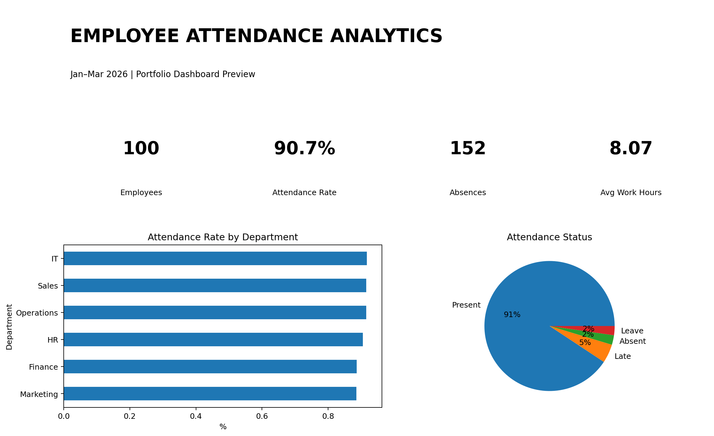

# Employee Attendance & Productivity Analytics

## 📊 Project Overview

This project analyzes employee attendance and productivity data to identify attendance patterns, department-wise performance, employee work behavior, and monthly attendance trends.

The project demonstrates how **Excel, SQL, Python, and Power BI** can be used together to perform an end-to-end data analytics workflow.

It is designed as a portfolio project for **Data Analyst, MIS Executive, MIS Analyst, and Business Analyst** roles.

---

## 🎯 Business Objective

The main objective of this project is to analyze employee attendance records and generate meaningful insights that can help an organization understand:

- Overall employee attendance
- Department-wise attendance performance
- Absence and leave patterns
- Late arrivals
- Employee working hours
- Monthly attendance trends
- Department-level productivity
- Attendance-related problem areas

---

## ❓ Business Questions

This project answers the following questions:

1. What is the overall attendance rate?
2. Which department has the highest attendance?
3. Which department has the highest number of absences?
4. How many employees were late?
5. What are the monthly attendance trends?
6. Which departments have higher average working hours?
7. How many employees are present, absent, late, or on leave?
8. How does attendance vary across different departments?
9. What is the average daily working time?
10. What patterns can be observed from employee attendance data?

---

## 🗂️ Dataset

The dataset contains synthetic employee attendance records for demonstration and portfolio purposes.

### Dataset Period

**January 2026 – March 2026**

### Dataset Includes

- 100 employees
- 6 departments
- Weekday attendance records
- Multiple employee locations
- Different work shifts
- Attendance status
- Daily working hours

### Departments

- IT
- HR
- Finance
- Sales
- Marketing
- Operations

### Attendance Status

- Present
- Late
- Leave
- Absent

---

## 📋 Dataset Columns

| Column | Description |
|---|---|
| Date | Attendance date |
| Employee_ID | Unique employee identifier |
| Employee_Name | Employee name |
| Department | Employee department |
| Location | Employee work location |
| Shift | Employee work shift |
| Status | Attendance status |
| Work_Hours | Number of hours worked |
| Month | Month of attendance |

---

## 🛠️ Tools & Technologies

### Microsoft Excel

Used for:

- Data cleaning
- Data validation
- Filtering and sorting
- Pivot tables
- Attendance calculations
- Department analysis
- Monthly analysis
- Dashboard preparation

### SQL

Used for:

- Data querying
- Aggregation
- GROUP BY analysis
- Attendance calculations
- Department comparisons
- Monthly trend analysis
- Employee-level analysis

### Python

Used for:

- Data analysis
- Data cleaning
- Statistical calculations
- Attendance trend analysis
- Department analysis
- Data visualization

Libraries used:

- pandas
- matplotlib

### Power BI

Used for:

- KPI visualization
- Interactive dashboard design
- Department-wise analysis
- Monthly attendance trends
- Attendance status analysis
- Data visualization

---

## 📁 Project Structure
```
Employee-Attendance-Analytics/
│
├── README.md
│
├── data/
│   └── employee_attendance.csv
│
├── excel/
│   └── Employee_Attendance_Analysis.xlsx
│
├── sql/
│   └── attendance_analysis.sql
│
├── python/
│   └── attendance_analysis.py
│
├── powerbi/
│   └── Attendance_Dashboard.png
│
├── reports/
│   ├── Attendance_Analysis_Report.pdf
│   ├── department_analysis.csv
│   └── monthly_analysis.csv
│
└── screenshots/
    ├── dashboard_preview.png
    ├── department_attendance.png
    └── monthly_attendance.png
```

## 📊 Power BI Dashboard


The Power BI dashboard provides a visual overview of employee attendance and productivity.

## Dashboard KPIs

The dashboard includes important metrics such as:
Total Employees
Total Attendance Records
Present Employees
Absent Employees
Late Employees
Leave Records
Attendance Rate
Average Work Hours

## Dashboard Analysis

The dashboard provides:
Attendance status breakdown
Department-wise attendance
Monthly attendance trends
Employee attendance analysis
Working-hours analysis
Department performance comparison


### Dashboard Preview



---

## 🔍 SQL Analysis

The SQL analysis includes queries for:

- Total attendance records
- Department-wise attendance
- Attendance status analysis
- Monthly attendance trends
- Average working hours
- Late and absent employee analysis

## SQL file:

sql/attendance_analysis.sql

---

## 🐍 Python Analysis

Python was used for data cleaning, analysis, calculations, and visualization.

Libraries used:

- Pandas
- Matplotlib

## Python file:

python/attendance_analysis.py

---

## 📑 Excel Analysis

The Excel workbook contains:

- Raw attendance data
- Department analysis
- Monthly analysis
- Dashboard

## Excel file:

excel/Employee_Attendance_Analysis.xlsx


## 📄 Project Report

## A detailed project report is included with the repository.

The report covers:
Project objective
Dataset description
Methodology
Data analysis
Findings
Visualizations
Business insights
Conclusion
## Report:

reports/Attendance_Analysis_Report.pdf


## 💡 Business Insights

The analysis can help management:

Monitor employee attendance
Identify departments with attendance issues
Track monthly attendance trends
Understand late-arrival patterns
Monitor employee working hours
Improve workforce planning
Support HR decision-making
Create regular MIS attendance reports


## 🚀 How to Use This Project

## Step 1 — Excel

Open:

excel/Employee_Attendance_Analysis.xlsx

Review the raw attendance data and analysis sheets.
## Step 2 — SQL

Import:

data/employee_attendance.csv

into a MySQL database and execute:
sql/attendance_analysis.sql
## Step 3 — Python

Install the required libraries:

## pip install pandas matplotlib
Run:

python python/attendance_analysis.py

##
Step 4 — Power BI

Import:

data/employee_attendance.csv
into Power BI Desktop and create the dashboard using the provided dashboard preview as a reference.


## 📌 Skills Demonstrated

This project demonstrates the following skills:

Data Cleaning
Data Analysis
Excel
Advanced Excel
Pivot Tables
SQL
MySQL
Python
Pandas
Matplotlib
Power BI
Data Visualization
KPI Reporting
MIS Reporting
Business Analysis
Dashboard Development
Data Interpretation
